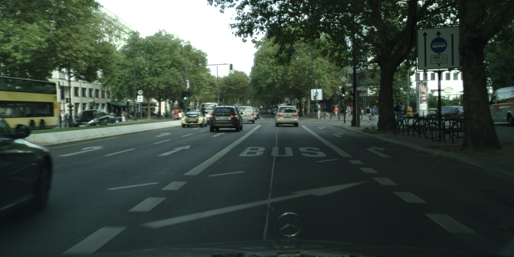
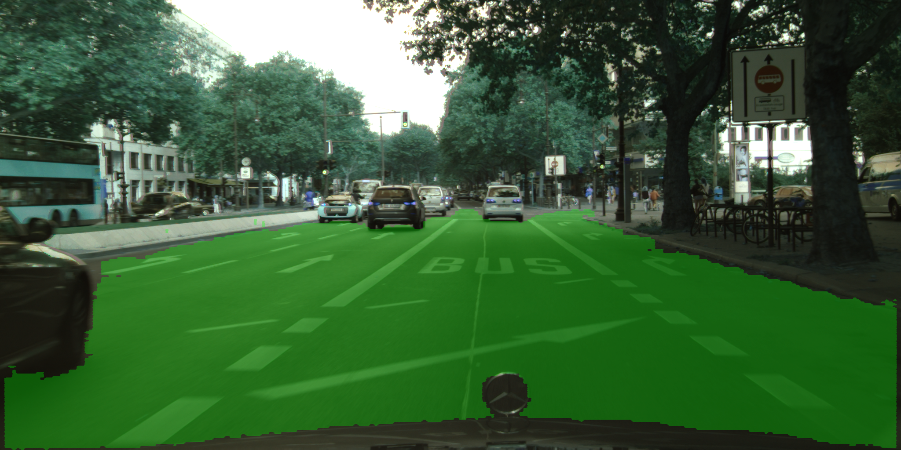

# SegNet

* 项目介绍参考我写的[这篇博客](https://blog.csdn.net/chenzhoujian_/article/details/106873451)

* cityscapes数据集的下载和介绍参考[这篇博客](https://blog.csdn.net/avideointerfaces/article/details/104139298)

* 数据集标签的处理参考我写的[这篇博客](https://blog.csdn.net/chenzhoujian_/article/details/106874950)

  ## 测试

  原图：

  

  结果：

  

  

  

